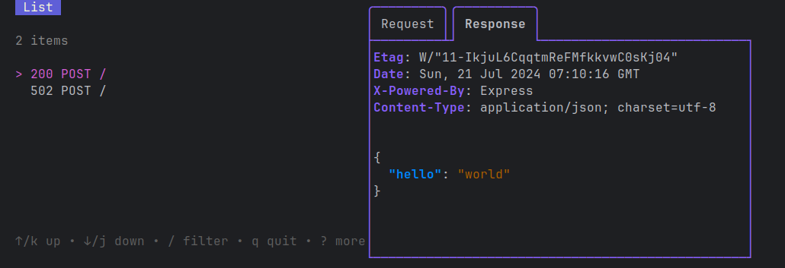

# MrProxy


Una de las herramientas más útiles cuando te toca desarrollar web y andás de *Full Stack Dev* es que podés ver cómo se 
comunica el navegador con el backend usando el network tab. Pero cuando te toca pasarte a desarrollo nativo (como móvil)
no hay herramientas default que ya hagan esto. Mientras que sí hay herramientas que pueden hacer un trabajo similar, 
generalmente te toca modificar un poco el código fuente para que funcionen bien.

No quería hacer nada de eso. Para esto decidí buscar lo inverso, que se loggearan las solicitudes desde el lado del 
servidor. Específicamente, quería que fuera más amigable que un montón de prints. Lo mejor que encontré era utilizar
un reverse proxy con logging. Aunque encontré algunos, no me gustaron mucho así que me hice el mío.

## Usage
```
./mrproxy http://localhost:3000
```


## TODO
- [ ] Poner mejores instrucciones
- [ ] Manejar más posibles respuestas
- [ ] Esconder los logs de error de ReverseProxy
- [ ] Mostrar colores con respuestas http
- [ ] Poner colores según el estado de la solicitud
- [ ] Mostrar el tiempo de cada solicitud
- [ ] Opción de copiar al portapapeles
